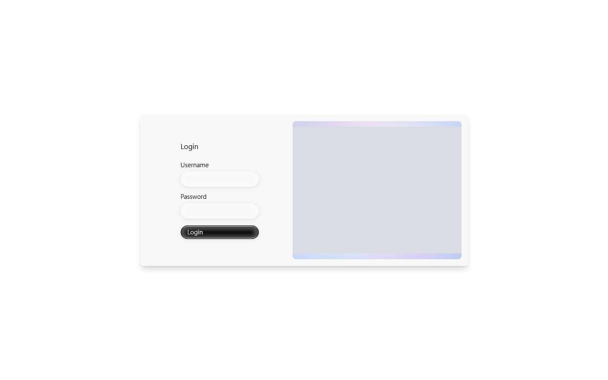
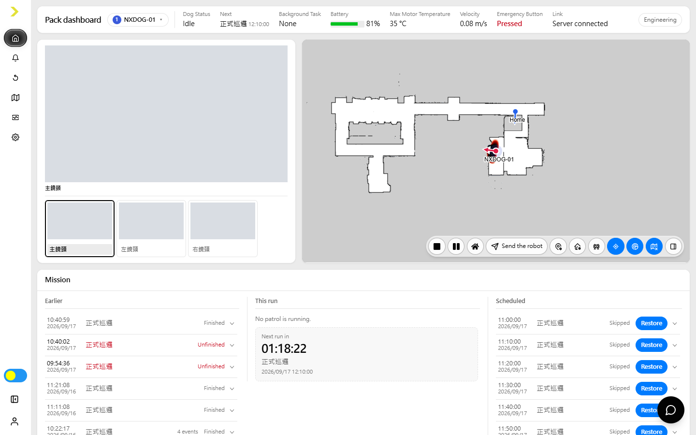
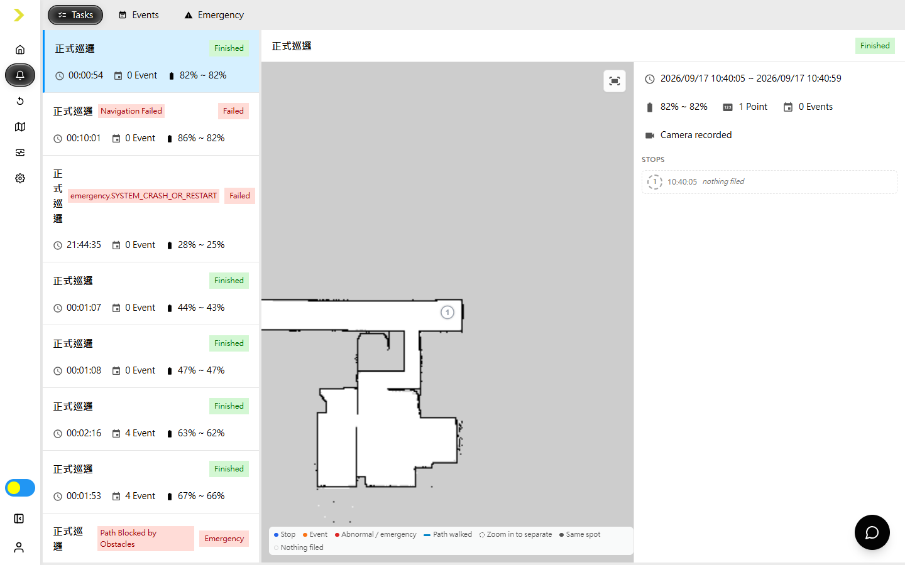
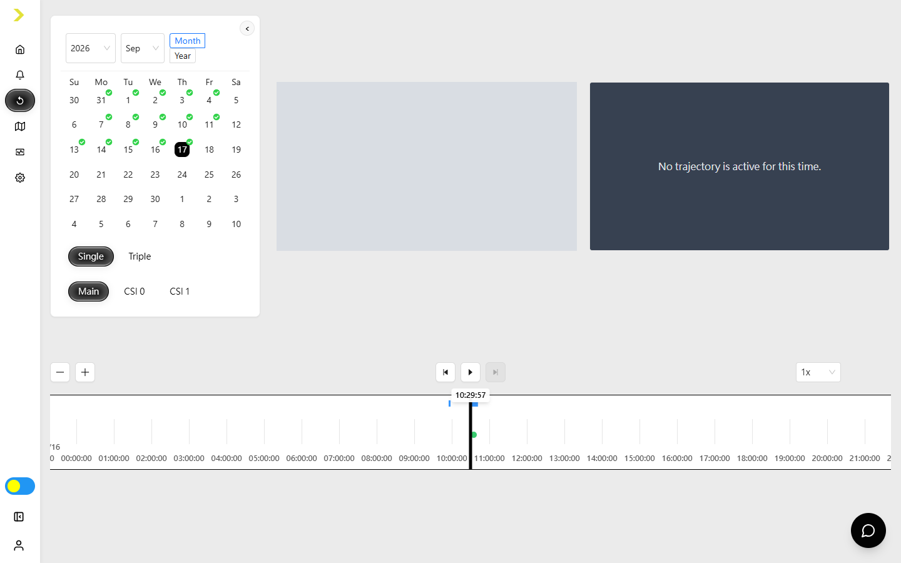
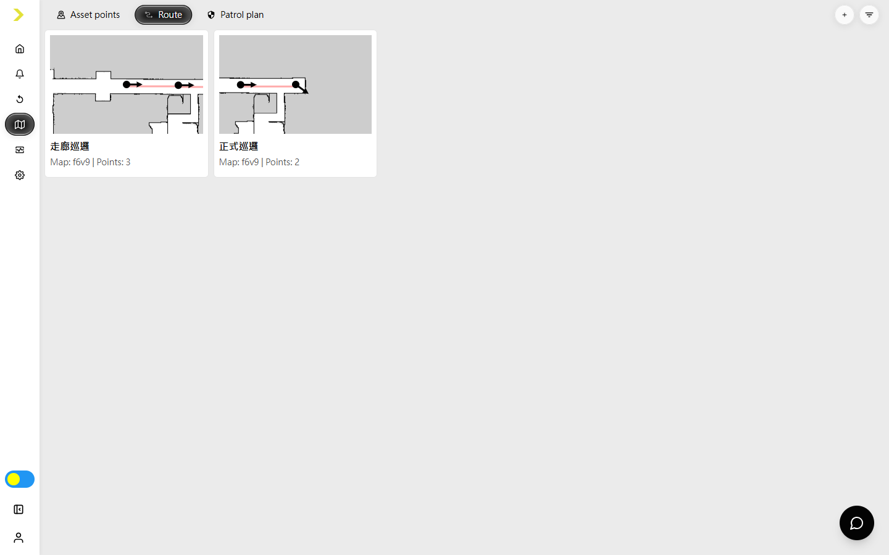
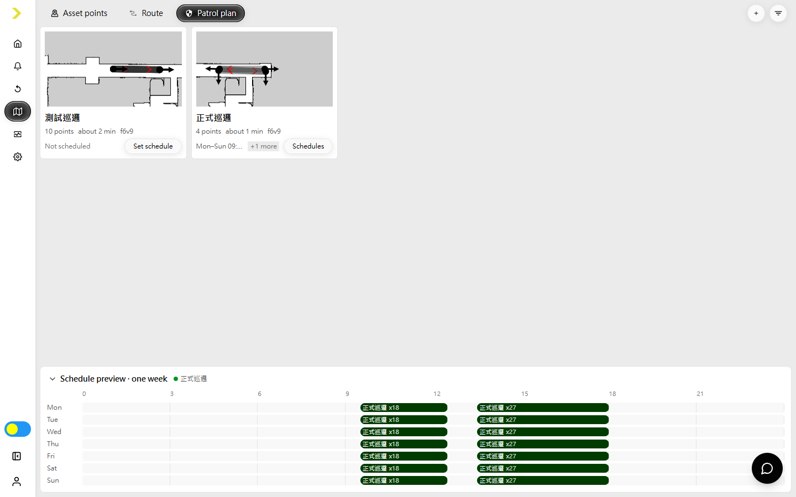
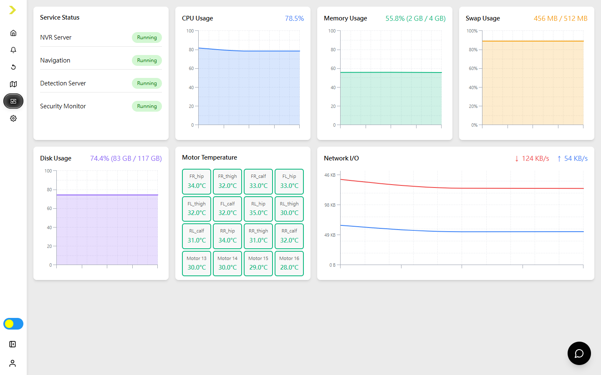
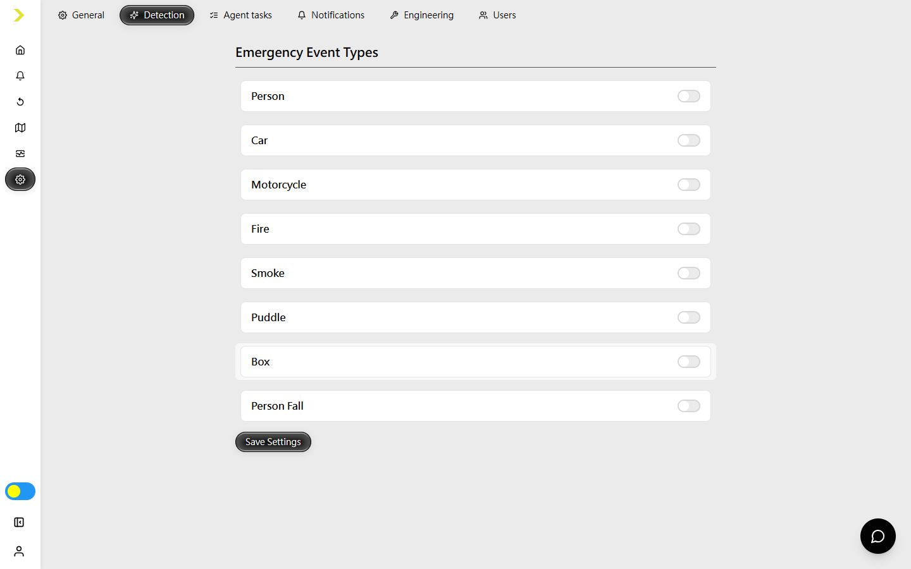
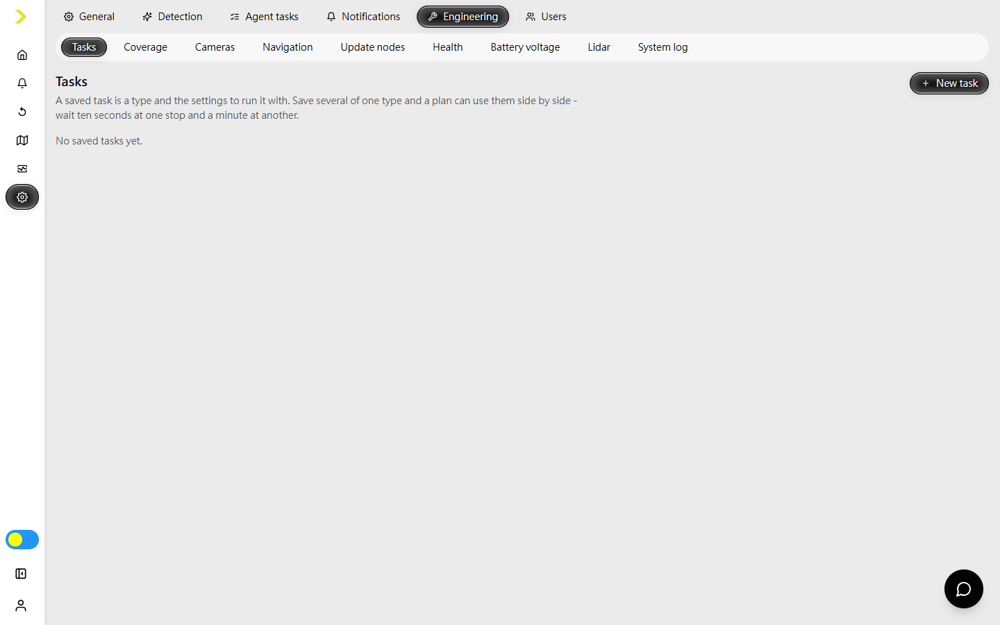
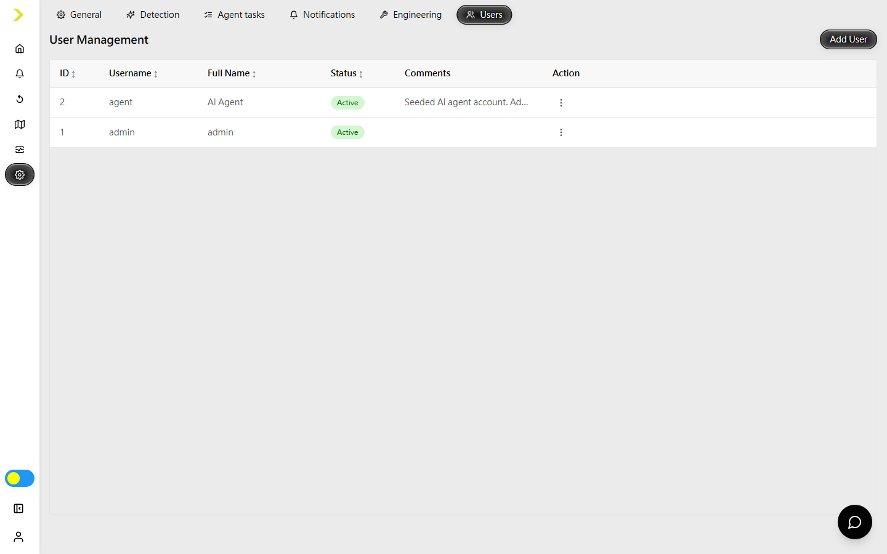

# Security Frontend User Guide

[繁體中文](security-frontend-user-guide.zh-TW.md)

This guide describes the current nxdog Security Frontend. The pages and actions available to you depend on your account role, permissions, enabled product features, and connected hardware.

## 1. Overview

The Security Frontend is the main web interface for monitoring and operating an nxdog security patrol robot. Use it to:

- Monitor robot, mission, camera, map, event, and sensor status.
- Send the robot to a map position, asset point, route, or patrol plan.
- Review task, detection, and emergency records.
- Replay NVR recordings and robot trajectories.
- Create asset points, routes, patrol plans, and schedules.
- Check service and hardware health.
- Configure the system, notifications, engineering tools, and users.

## 2. Before You Begin

1. Connect your computer and the robot-side computers to the same network.
2. Find the Pi 5 IP address assigned to the system.
3. Open `https://<pi5-ip>` in a current desktop browser.
4. Accept the browser's local-certificate warning only after confirming that the address is the correct robot.

The interface is designed for a desktop-sized display. A stable connection is especially important for live video, manual driving, software updates, and map editing.

## 3. Sign In and Account

### First-time setup

An uninitialized system opens the onboarding flow instead of the sign-in form. Follow the on-screen privacy and license steps, then create the first administrator account. Store the administrator password securely.

### Sign in

Enter your **Username** and **Password**, then select **Login**.

If an administrator assigned a temporary or default password, the system requires you to replace it before the rest of the interface becomes available.

### Account menu

Select your name at the bottom of the sidebar to:

- Open **Reset Password**, enter the current password, and choose a new password of at least eight characters.
- Select **Logout** to end the session.

### Language, date format, and theme

Open **Setting > General > Personalization** to choose:

- Interface language: English or Traditional Chinese.
- Date and time display format.
- System, light, or dark colour scheme.

Language and date-format preferences follow the signed-in account. The colour scheme is stored in the current browser.

## 4. Interface Tour

The left sidebar provides the main navigation:

| Page | Purpose |
| --- | --- |
| **Home** | Live operations dashboard. |
| **Logs** | Task reports, detection events, and emergency events. |
| **Replay** | Recorded video, timeline, and trajectory replay. |
| **Map** | Asset points, routes, and patrol plans. |
| **Health** | Service, computer, storage, network, and motor health. |
| **Setting** | Personal, system, notification, engineering, and user settings. |

Use **Collapse** to show only sidebar icons. The colour toggle near the lower-left corner switches the current browser between light and dark display. Settings are hidden if your account has none of the required permissions.

## 5. Quick Start: Create and Run a Patrol

1. Open **Setting > General > System** and confirm the active map. Upload a map package first if the required map is not available.
2. On **Home**, use **Set home point** to place the Home marker at the charging station and point its arrow in the docking direction.
3. Open **Map > Asset points**, select **+**, choose a map, name the point, optionally assign a group, and place and orient it on the map.
4. Open **Map > Route**, select **+**, choose the map, enter a name and speed, then add route points in travel order and set their headings.
5. Open **Map > Patrol plan**, select **+**, assemble a patrol from routes, asset points, existing plans, and task actions, then save it.
6. Select **Set schedule** on the patrol card to add one or more weekly schedules, or run the patrol immediately from **Home > Send the robot > Patrol plan**.

Always confirm that the map, Home position, route direction, safety area, and robot surroundings are correct before dispatching a task.

## 6. Home Dashboard

The Home page is the live operating view. Its header shows the selected robot, current and next work, background task, battery, maximum motor temperature, velocity, emergency-button state, and server link.

### Cameras and map

- The camera panel shows the available main, side, thermal, PTZ, or lidar feeds for the selected robot. Use the feed controls to pause, resume, refresh, expand, or enter full screen when supported.
- The map shows the robot, Home point, live navigation path, next stop, temporary no-go zones, obstacles, and unreachable areas.
- Drag and zoom the map as needed. **Follow robot** returns the view to the selected robot after manual panning.
- The obstacle display cycles between all scan structure, obstacles only, and off. The reachability control shows or hides areas the robot cannot currently reach.

### Task controls

The map command row provides the controls your account is allowed to use:

- **Stop** clears the current queued work.
- **Pause/Resume** holds or continues the current task.
- **Go Home** sends the robot to its configured Home point.
- **Send the robot** opens four dispatch methods:
  - **Click to go**: select a reachable position on the map and confirm it.
  - **Route**: select a saved route and review its map preview.
  - **Asset point**: select a saved named destination.
  - **Patrol plan**: select a plan and its available run options.
- **No-go zones** temporarily closes a rectangular area so navigation routes around it. Choose a duration or keep it closed until manually reopened.
- **Set home point** moves and rotates the Home marker. Save only when the marker matches the real charging station.

Controls become unavailable when the selected robot is offline or an AI agent has taken control.

### Engineering mode

Administrators with robot-control permission can enable **Engineering** in the header. It adds manual driving controls and direct robot instruments for microphone audio, canned audio, lighting, posture/mode, and skipping the current stop.

Manual driving is intended for an operator standing near the robot. It is available only while the robot is idle or charging. Confirm the area is clear before moving the robot.

### Mission and event panels

- **Mission** separates earlier runs, the current run, and scheduled runs. Expand a run for its stops and events. Authorized users can skip or restore eligible scheduled runs.
- **Events** shows recent detections and their details.
- **Records** highlights emergency and failed-task records.
- **Sensor modules** shows the latest health reported by compute, motor, thermal, gas, navigation, NVR, detection, and security-monitor modules when installed.
- The chat button opens **NXDOG Assistant** when the server has a chat service configured.

## 7. Logs

Open **Logs** and choose **Tasks**, **Events**, or **Emergency**.

### Tasks

The Tasks tab is the default view. Select a run to see its source, result, duration, battery usage, route on the map, stop sequence, and associated detections or failures. Runs can originate from a schedule, manual dispatch, or AI agent.

### Events

The Events tab lists AI detections. Filter by event type, time range, or a selected map area. Switch between image and map views, and use the PDF action to export the currently filtered event list.

### Emergency

The Emergency tab lists navigation, network, safety, and other urgent records. Use the display options to inspect record details and locations. Status and available actions vary with the event and your permissions.

## 8. Replay

Open **Replay** to review NVR recordings together with the robot trajectory.

1. Select a date in the calendar. Dates with recordings are indicated by the interface.
2. Choose **Single** for one camera or **Triple** for the three configured channels.
3. In Single mode, select the camera to display.
4. Select a recorded segment on the timeline or drag the playhead to the required time.
5. Use **Play/Pause**, **Previous event**, **Next event**, timeline zoom, and the `0.5x` to `8x` speed selector.
6. Use the collapse arrow to give the video area more space. Audio, volume, and per-camera controls appear only when the recording and browser support them.

The map panel follows recorded trajectory data for the selected time. If the page reports no video or no active trajectory, choose another recorded segment or verify NVR and navigation service health.

## 9. Map Management

Map pages are hidden from Viewer accounts and are further controlled by feature permissions. The map selector and search/filter controls are in the upper-right filter menu.

### Asset points

Asset points are named destinations used by operators and patrol plans.

To create one, open **Map > Asset points**, select **+**, choose a map, enter a name and optional group, click the map to set the position, adjust its heading, and save. Select an existing card to edit or delete it. Use search, map, and group filters to locate points.

### Routes

Routes are ordered paths with a saved speed level.

To create one, open **Map > Route**, select **+**, choose a map, enter a name, select a speed multiplier, and click the map in travel order to add points. Select a point to adjust its heading or remove it. Save when the preview follows the intended safe path. Select an existing route card to edit or delete it.

### Patrol plans

A patrol plan combines a point sequence with actions that run at selected points.

1. Open **Map > Patrol plan** and select **+**, or select an existing plan card to edit it.
2. Name the plan and confirm its map.
3. Add saved routes, asset points, or reusable plan sequences from the source rail. You can also pick points directly on the map.
4. Reorder or remove points in the sequence.
5. Add supported tasks to individual points or across a selected point range. Task types depend on the connected robot and configured agent capabilities.
6. Review the point, distance, and estimated-duration summary, then select **Save**.

The editor warns before leaving with unsaved changes. Deleting a plan requires confirmation.

### Schedules

Select **Set schedule** or **Schedule** on a patrol card. Each plan can have multiple schedules. For each schedule:

1. Enter a schedule name.
2. Select the start and end weekday.
3. Set the daily start and end time.
4. Set the repeat interval.
5. Choose whether the robot returns Home after completion.
6. Save the schedule.

The weekly preview below the cards shows when each plan will run. Edit or delete schedules from the schedule dialog. Check overlapping schedules and charging time before enabling frequent runs.

## 10. Health

Open **Health** to check service and device status.

The page reports:

- NVR, navigation, detection, and security-monitor service status.
- CPU, memory, swap, and disk usage.
- Motor temperatures.
- Network input and output rates.

Treat persistent stopped services, high disk usage, or abnormal motor temperatures as maintenance issues. Confirm that data is current before diagnosing a robot that has lost its network connection.

## 11. Setting

Visible tabs depend on permissions. **General** is available to accounts that can read their profile. Configuration tabs require settings permission. **Users** requires user-management permissions.

### General

- **Personalization**: colour scheme, date/time format, and interface language.
- **System**: automatic charging, patrol lighting, active map, map upload, and canned sound upload when permitted.
- **Licenses**: view and update product-license information.
- **Software**: review component versions, choose update targets, start an update, and monitor its persisted progress.

Software updates, map changes, restarts, and uploads can interrupt operation. Perform them only during an approved maintenance window.

### Detection

Choose which configured detection types are treated as emergency events, then select **Save Settings**.

### Agent tasks

This tab lists tasks supplied by an AI agent rather than built into the central server. Authorized users can add a task name, display label, instruction, expected outcome guidance, and an available agent source. These tasks can then be assigned to points in a patrol plan.

### Notifications

Configure Telegram subscriber IDs, email recipients, sender address, and sender password. Press Enter after each Telegram ID or recipient address so it becomes a list item, then select **Save Settings**. Treat the sender password as a secret.

### Engineering

Engineering provides specialized subpages:

- **Tasks**: reusable built-in task presets for patrol plans.
- **Coverage**: plan map coverage and keep-out areas.
- **Cameras**: configure camera devices and streams.
- **Navigation**: goal tolerances and the default movement speed level.
- **Update nodes**: define which devices and modules participate in software updates.
- **Health**: disk and ROS diagnostics.
- **Battery voltage**: review controller and robot-battery voltage history.
- **Lidar**: inspect lidar data and source status.
- **System log**: audit user actions and system operations.

These controls affect robot behaviour and service configuration. They should be changed only by trained administrators.

### Users

Administrators can add users and assign a role, full name, password, and comments. The row action menu can edit or delete the user, reset the password, and activate or deactivate the account when permitted. A **Default password** badge means the user must change that password at the next sign-in.

## 12. Operational Notes and Troubleshooting

- **A page or button is missing:** your role, feature permissions, license, or connected hardware may not expose it. Ask an administrator before treating this as a fault.
- **The robot is offline:** verify the **Link** indicator, network connection, and Health service status. Dispatch controls remain disabled until the selected robot is reachable.
- **Commands are blocked:** an AI takeover, emergency state, active task, or insufficient permission can disable controls. Do not attempt to bypass the safety state.
- **A destination is grey or unreachable:** confirm the active map, robot localization, walls, and no-go zones. Move the destination to a reachable area or correct the map configuration.
- **No video is shown:** refresh the feed, verify that the camera exists under **Setting > Engineering > Cameras**, and check NVR service health.
- **Replay is empty:** select a date and blue/recorded timeline segment, then confirm NVR availability and clock synchronization.
- **A patrol does not run:** confirm it has points, supported tasks, a valid schedule, and no conflicting or skipped schedule entry.
- **Localization has drifted:** use the authorized localization controls on Home/Engineering only when the robot's real position is known. An incorrect pose can make every subsequent navigation unsafe.
- **An update appears stuck:** do not refresh repeatedly or restart power. Reopen **Setting > General > Software** and review the persisted batch status before escalating.

When reporting a problem, include the time, selected robot, page, visible error, and relevant task or event record without including passwords or access tokens.
