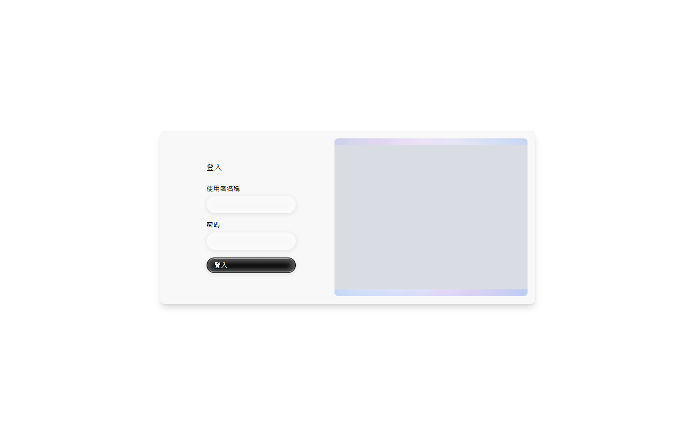
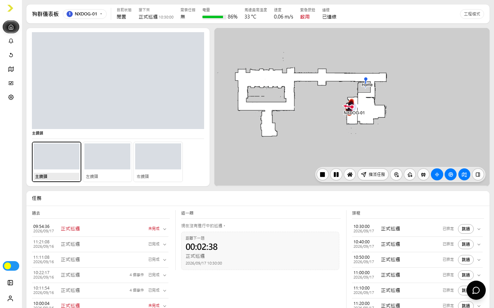
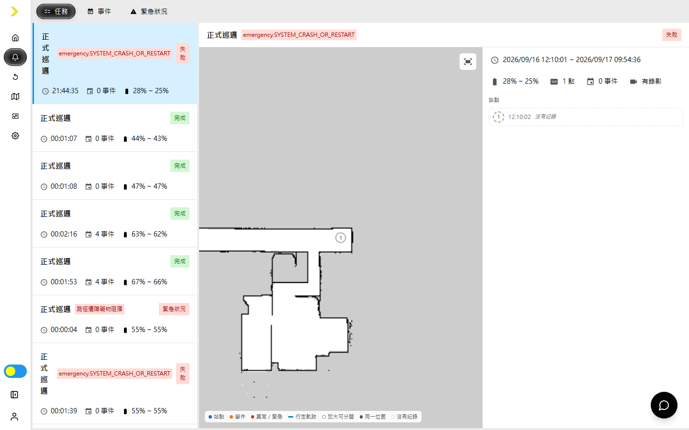
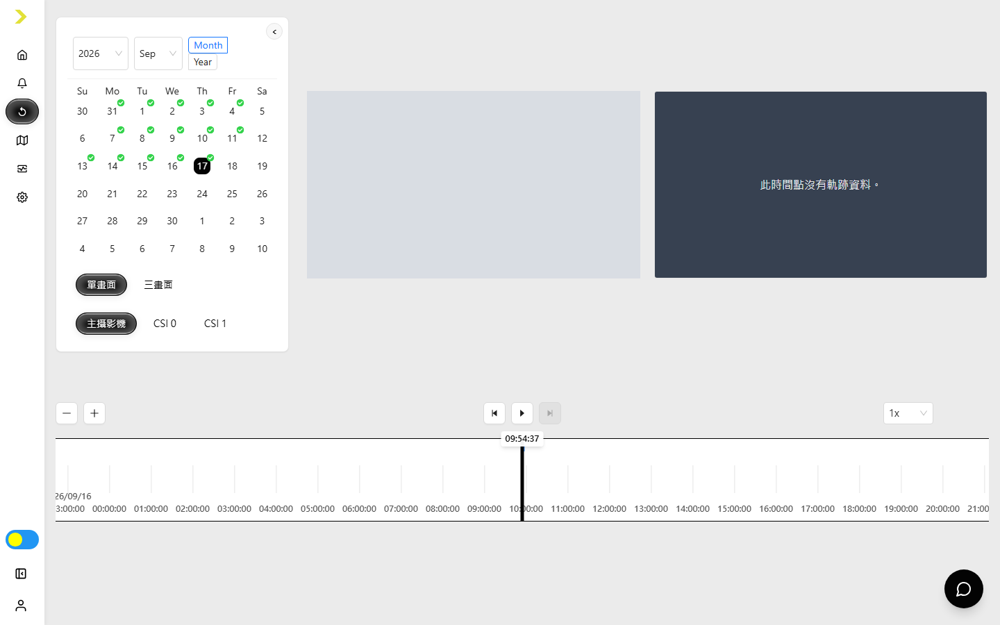
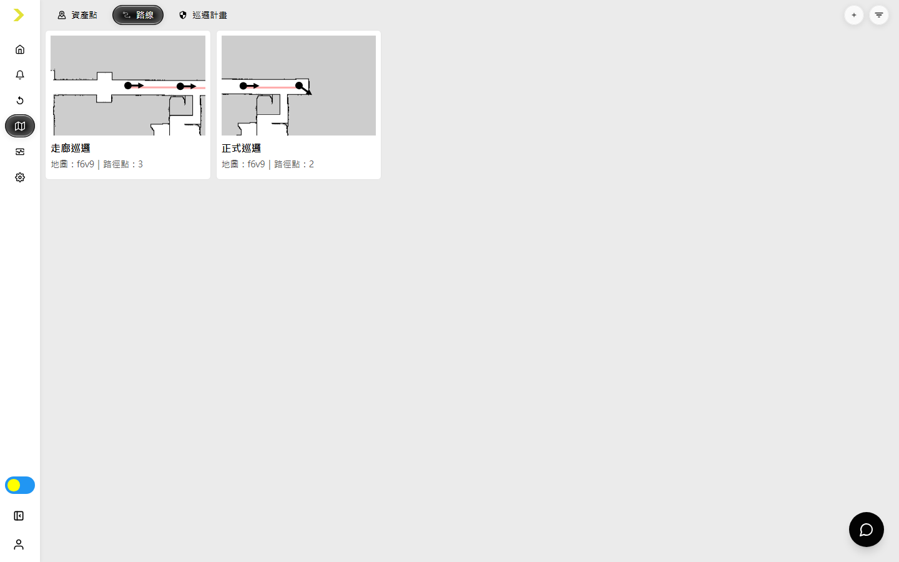
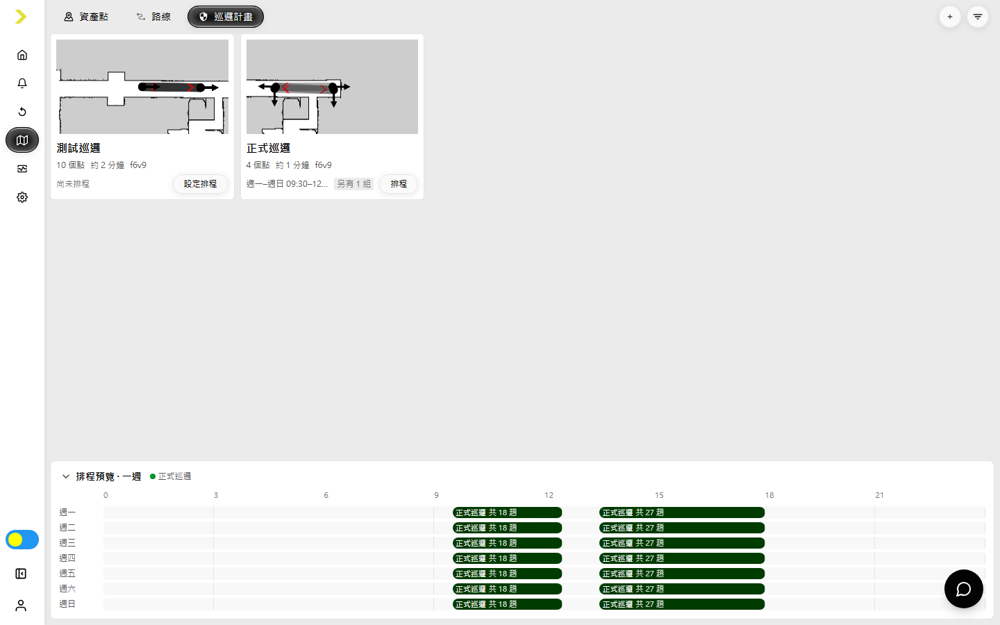
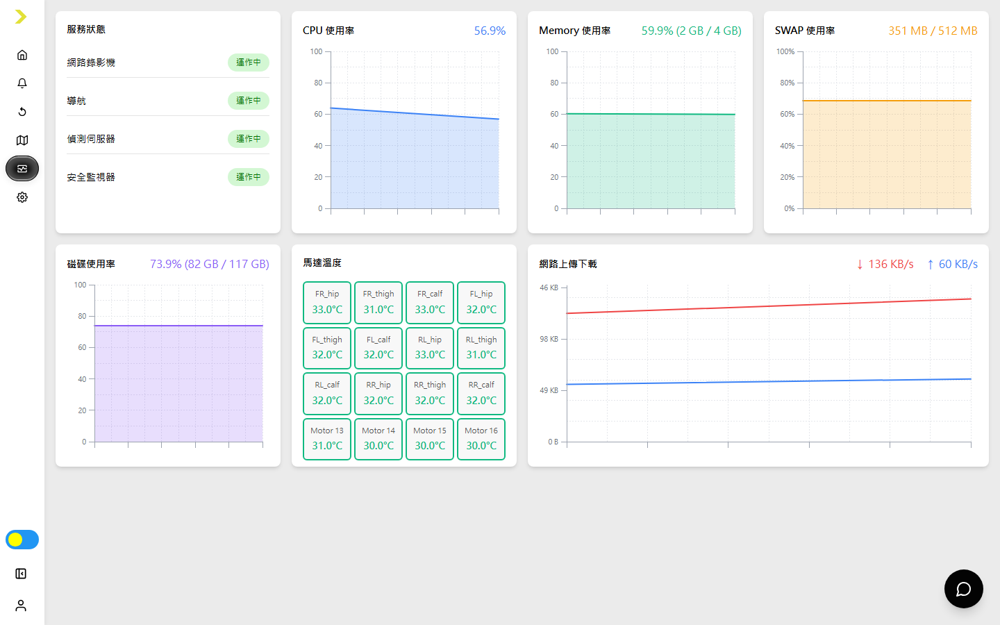
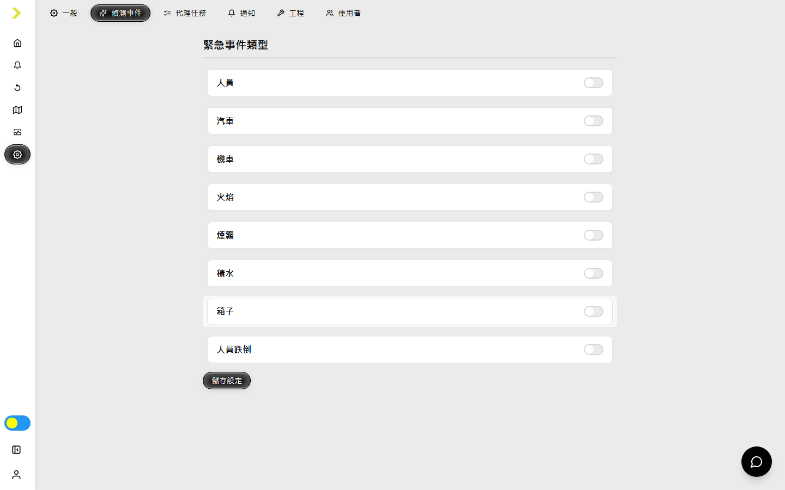
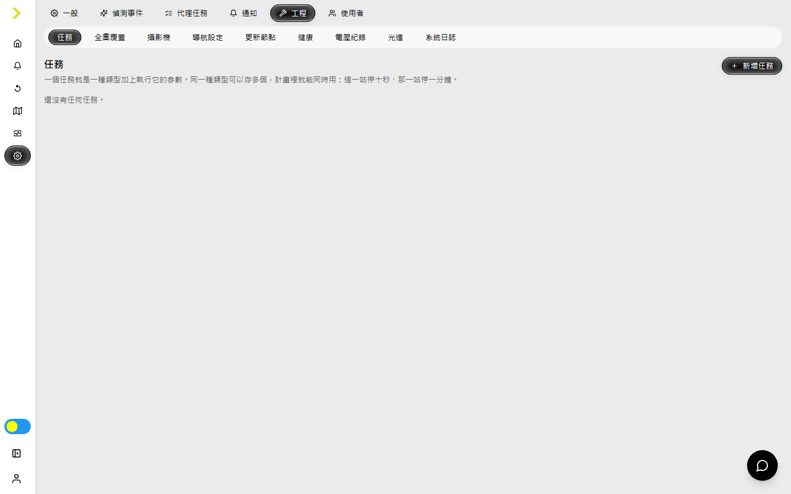
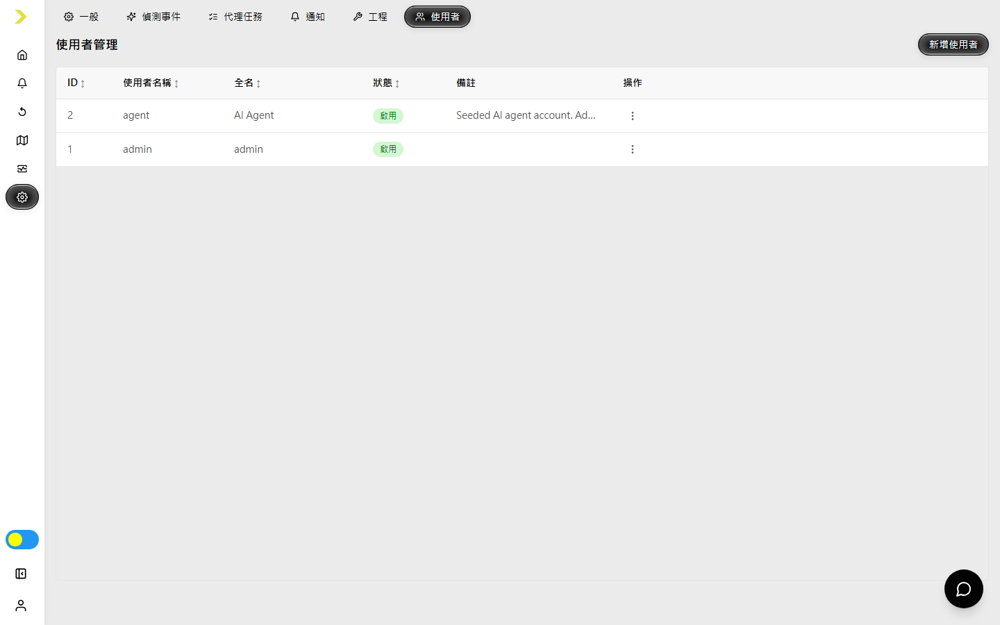

# Security Frontend 使用指南

[English](security-frontend-user-guide.md)

本指南說明目前版本的 nxdog Security Frontend。實際可見的頁面與操作會依帳號角色、權限、已啟用的產品功能及連接的硬體而異。

## 1. 概覽

Security Frontend 是監看及操作 nxdog 保全巡邏機器狗的主要網頁介面，可用於：

- 監看機器狗、任務、鏡頭、地圖、事件及感測器狀態。
- 指派機器狗前往地圖位置、資產點、路線或執行巡邏計畫。
- 查閱任務、偵測及緊急狀況紀錄。
- 重播 NVR 錄影與機器狗軌跡。
- 建立資產點、路線、巡邏計畫及排程。
- 檢查服務與硬體健康狀態。
- 設定系統、通知、工程工具及使用者。

## 2. 使用前準備

1. 將操作電腦與機器狗端電腦連接至同一個網路。
2. 查出系統 Pi 5 的 IP 位址。
3. 使用新版桌面瀏覽器開啟 `https://<pi5-ip>`。
4. 只有在確認網址確實屬於正確的機器狗後，才接受瀏覽器顯示的本機憑證警告。

介面以桌面尺寸顯示器為主要使用環境。即時影像、手動駕駛、軟體更新及地圖編輯尤其需要穩定的網路連線。

## 3. 登入與帳號

### 首次設定

尚未初始化的系統會顯示初始設定流程，而不是登入表單。依畫面完成隱私權與授權步驟，然後建立第一個管理員帳號。請妥善保管管理員密碼。

### 登入

輸入**使用者名稱**與**密碼**，再選取**登入**。

若管理員配置的是暫時密碼或預設密碼，系統會要求先更換密碼，完成後才能使用其餘介面。

### 帳號選單

選取側邊欄底部的使用者名稱，可以：

- 開啟**重設密碼**，輸入目前密碼並設定至少八個字元的新密碼。
- 選取**登出**結束工作階段。

### 語言、日期格式與主題

開啟**設定 > 一般 > 個人化**，可以選擇：

- 介面語言：English 或繁體中文。
- 日期與時間顯示格式。
- 跟隨系統、淺色或深色配色。

語言和日期格式會跟隨登入帳號；配色則儲存在目前使用的瀏覽器。

## 4. 介面導覽

左側邊欄提供主要導覽：

| 頁面 | 用途 |
| --- | --- |
| **首頁** | 即時操作儀表板。 |
| **紀錄** | 任務報告、偵測事件與緊急狀況。 |
| **重播** | 錄影、時間軸與軌跡重播。 |
| **地圖** | 資產點、路線與巡邏計畫。 |
| **健康** | 服務、電腦、儲存空間、網路及馬達健康狀態。 |
| **設定** | 個人、系統、通知、工程及使用者設定。 |

選取**縮小**可以只顯示側邊欄圖示。左下方的配色開關可以切換目前瀏覽器的明暗顯示。若帳號沒有任何相關權限，設定頁不會顯示。

## 5. 快速開始：建立並執行巡邏

1. 開啟**設定 > 一般 > 系統**，確認目前使用的地圖；若沒有需要的地圖，先上傳地圖套件。
2. 在**首頁**使用**設定充電座位置**，將 Home 標記放在充電座，並使箭頭朝向進入充電座的方向。
3. 開啟**地圖 > 資產點**並選取 **+**，選擇地圖、輸入名稱、視需要指定群組，然後在地圖上放置位置並設定朝向。
4. 開啟**地圖 > 路線**並選取 **+**，選擇地圖、輸入名稱與速度，再依行走順序加入路徑點並設定各點朝向。
5. 開啟**地圖 > 巡邏計畫**並選取 **+**，使用路線、資產點、既有計畫及任務動作組合巡邏內容，然後儲存。
6. 在巡邏卡片選取**設定排程**，加入一或多組每週排程；也可以從**首頁 > 指派任務 > 巡邏計畫**立即執行。

派送任務前，務必確認地圖、Home 位置、路線方向、安全範圍及機器狗周遭環境均正確。

## 6. 首頁儀表板

首頁是即時操作畫面。頂端會顯示選取的機器狗、目前與下一項工作、背景任務、電量、馬達最高溫度、速度、緊急按鈕狀態及伺服器連線。

### 鏡頭與地圖

- 鏡頭區顯示所選機器狗可用的主鏡頭、側面鏡頭、熱像、PTZ 或光達畫面。硬體支援時，可以暫停、繼續、重整、放大或使用全螢幕。
- 地圖會顯示機器狗、Home 點、即時導航路徑、下一站、暫時禁行區、障礙物及目前無法抵達的區域。
- 可拖曳及縮放地圖。手動移動地圖後，使用**跟隨機器狗**讓畫面重新跟隨所選機器狗。
- 障礙物顯示可在完整掃描結構、僅障礙物及關閉之間切換；可達性按鈕則顯示或隱藏目前走不到的區域。

### 任務控制

地圖命令列會依帳號權限提供下列控制：

- **停止**：清除目前佇列中的工作。
- **暫停／繼續**：暫停或恢復目前任務。
- **回家**：讓機器狗前往已設定的 Home 點。
- **指派任務**提供四種方式：
  - **點擊前往**：在地圖上選取可到達位置並確認。
  - **路線**：選擇已儲存路線並查看地圖預覽。
  - **資產點**：選擇已命名並儲存的目的地。
  - **巡邏計畫**：選擇計畫及可用的執行選項。
- **導航禁行區**：暫時封閉矩形範圍，使導航繞行；可設定封閉時間或維持到手動解除。
- **設定充電座位置**：移動並旋轉 Home 標記。只有在標記和實際充電座一致時才儲存。

當所選機器狗離線或 AI 代理接管時，相關控制會停用。

### 工程模式

具有機器狗控制權限的管理員可從頂端啟用**工程模式**。啟用後會加入手動駕駛，以及麥克風音訊、預錄音效、燈光、姿態／模式及跳過目前站點等直接控制。

手動駕駛供站在機器狗附近的操作人員使用，且只會在機器狗閒置或充電時出現。移動前務必確認周遭無人員及障礙物。

### 任務與事件區

- **任務**分為過去、這一趟及排程。展開一趟任務可查看站點與事件；有權限的使用者可略過或恢復符合條件的排程。
- **事件**顯示近期偵測及其詳細資訊。
- **紀錄**特別列出緊急狀況與失敗任務。
- **感測模組**顯示已安裝的運算、馬達、熱像、氣體、導航、NVR、偵測及安全監視模組所回報的最新健康狀態。
- 伺服器已設定聊天服務時，右下角聊天按鈕會開啟 **NXDOG Assistant**。

## 7. 紀錄

開啟**紀錄**，再選擇**任務**、**事件**或**緊急狀況**。

### 任務

任務是預設頁籤。選取一趟任務後，可以查看來源、結果、耗時、耗電量、地圖路徑、站點順序及相關偵測或失敗資訊。任務來源可能是排程、手動指派或 AI 代理。

### 事件

事件頁列出 AI 偵測結果。可依事件類型、時間範圍或選取的地圖區域篩選，切換影像與地圖檢視，並使用 PDF 操作匯出目前篩選後的事件清單。

### 緊急狀況

緊急狀況頁列出導航、網路、安全及其他需立即注意的紀錄。使用顯示選項查看詳細資訊與位置；狀態及可用操作會依事件和帳號權限而異。

## 8. 重播

開啟**重播**，可同時查看 NVR 錄影與機器狗軌跡。

1. 在日曆選擇日期；有錄影的日期會由介面標示。
2. 選擇**單畫面**顯示一個鏡頭，或選擇**三畫面**顯示三個已設定頻道。
3. 使用單畫面時，選擇要顯示的攝影機。
4. 選取時間軸上的錄影區段，或拖曳播放位置到需要的時間。
5. 使用**播放／暫停**、**上一個事件**、**下一個事件**、時間軸縮放，以及 `0.5x` 至 `8x` 播放速度。
6. 使用收合箭頭增加影片顯示空間。只有錄影和瀏覽器支援時，才會顯示音訊、音量及個別鏡頭控制。

地圖會依選取時間顯示已記錄的軌跡。若畫面顯示沒有錄影或沒有有效軌跡，請改選其他錄影區段，或檢查 NVR 與導航服務健康狀態。

## 9. 地圖管理

Viewer 帳號不會顯示地圖管理頁，其他頁籤也會再依功能權限控制。地圖選擇器及搜尋／篩選工具位於右上角的篩選選單。

### 資產點

資產點是操作人員與巡邏計畫可使用的命名目的地。

若要建立資產點，開啟**地圖 > 資產點**並選取 **+**，選擇地圖、輸入名稱與選填群組、在地圖點選位置、調整朝向，再儲存。選取既有卡片可以編輯或刪除。可用搜尋、地圖及群組篩選器尋找資產點。

### 路線

路線是具有儲存速度等級的連續路徑。

若要建立路線，開啟**地圖 > 路線**並選取 **+**，選擇地圖、輸入名稱、選取速度倍率，再依行走順序在地圖加入路徑點。選取路徑點可調整朝向或移除。確認預覽符合預期的安全路徑後再儲存。選取既有路線卡片可以編輯或刪除。

### 巡邏計畫

巡邏計畫會將站點順序與在指定站點執行的動作組合在一起。

1. 開啟**地圖 > 巡邏計畫**並選取 **+**；或選取既有計畫卡片進行編輯。
2. 輸入計畫名稱並確認地圖。
3. 從來源列加入已儲存的路線、資產點或可重用的計畫序列，也可直接在地圖選點。
4. 在序列中重新排序或移除站點。
5. 對單一站點或選取的站點範圍加入支援的任務。任務類型會依連接的機器狗及已設定的代理能力而異。
6. 檢查站點數、距離及預估時間摘要，再選取**儲存**。

若有未儲存變更，離開編輯器前會顯示警告；刪除計畫也需要再次確認。

### 排程

在巡邏卡片選取**設定排程**或**排程**。每個計畫可以有多組排程。每組排程需：

1. 輸入排程名稱。
2. 選擇開始及結束星期。
3. 設定每日開始及結束時間。
4. 設定重複間隔。
5. 選擇完成後是否返回 Home。
6. 儲存排程。

卡片下方的每週預覽會顯示各計畫的執行時間。可從排程對話框編輯或刪除排程。設定高頻率巡邏前，請檢查排程是否重疊及是否保留足夠充電時間。

## 10. 健康

開啟**健康**以檢查服務與裝置狀態。

頁面會顯示：

- NVR、導航、偵測及安全監視服務狀態。
- CPU、Memory、SWAP 及磁碟使用率。
- 馬達溫度。
- 網路上傳與下載速率。

服務持續停止、磁碟使用率過高或馬達溫度異常時，應安排維護。若機器狗已斷線，診斷前先確認畫面資料是否仍為最新狀態。

## 11. 設定

可見頁籤會依權限而異。可讀取個人資料的帳號能使用**一般**；其他設定頁籤需要設定權限；**使用者**則需要使用者管理權限。

### 一般

- **個人化**：配色、日期／時間格式與介面語言。
- **系統**：自動充電、巡邏燈光、目前地圖、地圖上傳，以及有權限時的預錄音效上傳。
- **授權**：查看及更新產品授權資訊。
- **軟體**：查看元件版本、選擇更新目標、開始更新並監看持久化的更新進度。

軟體更新、地圖切換、服務重新啟動及上傳可能中斷運作，應只在核准的維護時段執行。

### 偵測事件

選擇哪些已設定的偵測類型應視為緊急事件，然後選取**儲存設定**。

### 代理任務

此頁列出 AI 代理提供、而非中控伺服器內建的任務。有權限的使用者可以新增任務名稱、顯示名稱、指示內容、預期結果說明及可用的代理來源。建立後即可將這些任務配置到巡邏計畫的站點。

### 通知

設定 Telegram 訂閱者 ID、電子郵件收件者、寄件者地址及寄件者密碼。每輸入一個 Telegram ID 或收件地址後按 Enter，使其成為清單項目，再選取**儲存設定**。寄件者密碼屬於機密資訊。

### 工程

工程頁提供下列專用子頁：

- **任務**：巡邏計畫可重用的內建任務預設。
- **全圖覆蓋**：規劃地圖覆蓋區域與禁行範圍。
- **攝影機**：設定攝影機裝置與串流。
- **導航設定**：目標容許誤差與預設移動速度等級。
- **更新節點**：定義參與軟體更新的裝置及模組。
- **健康**：磁碟與 ROS 診斷。
- **電壓紀錄**：查看控制器及機器狗電池電壓歷史。
- **光達**：檢視光達資料與來源狀態。
- **系統日誌**：稽核使用者操作及系統作業。

這些控制會影響機器狗行為及服務設定，應只由受過訓練的管理員修改。

### 使用者

管理員可新增使用者並指定角色、全名、密碼及備註。具備對應權限時，資料列的操作選單可以編輯或刪除使用者、重設密碼，以及啟用或停用帳號。顯示**預設密碼**標記代表該使用者下次登入時必須變更密碼。

## 12. 操作注意事項與疑難排解

- **頁面或按鈕未顯示：**帳號角色、功能權限、授權或連接硬體可能未提供該功能。判定為故障前先向管理員確認。
- **機器狗離線：**檢查**連線**指示、網路連接及健康頁的服務狀態。所選機器狗恢復連線前，指派控制會維持停用。
- **命令被阻擋：**AI 接管、緊急狀態、執行中的任務或權限不足都可能停用控制。請勿嘗試繞過安全狀態。
- **目的地顯示為灰色或無法抵達：**確認目前地圖、機器狗定位、牆面及導航禁行區。將目的地移至可到達區域，或修正地圖設定。
- **沒有影像：**重整串流、確認**設定 > 工程 > 攝影機**中存在該攝影機，並檢查 NVR 服務健康狀態。
- **重播沒有內容：**選擇日期與有錄影的時間軸區段，再確認 NVR 可用性及系統時間同步。
- **巡邏未執行：**確認計畫含有站點、任務受到支援、排程有效，且排程未衝突或被略過。
- **定位發生偏移：**只有在確定機器狗實際位置時，才使用首頁／工程頁中有權限限制的定位控制。錯誤姿態會使後續導航都不安全。
- **更新似乎停止：**請勿重複重新整理或直接斷電。重新開啟**設定 > 一般 > 軟體**並查看持久化的批次狀態，再決定是否通報。

回報問題時，請提供發生時間、所選機器狗、頁面、可見錯誤及相關任務或事件紀錄，但不要附上密碼或存取權杖。
