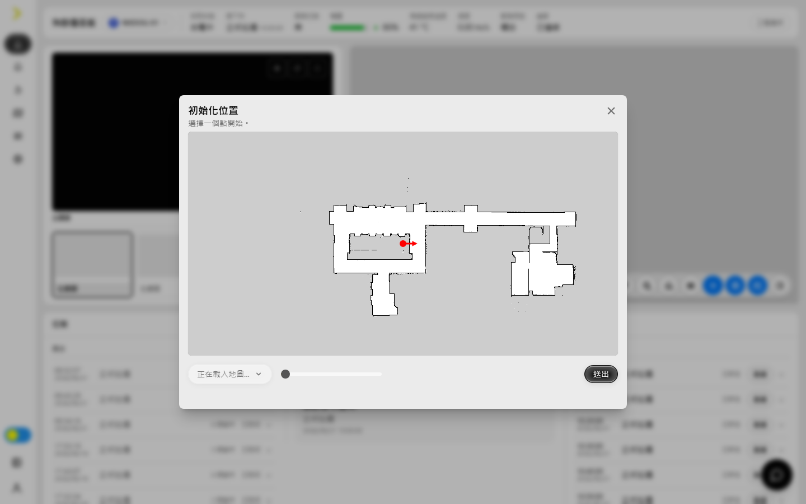
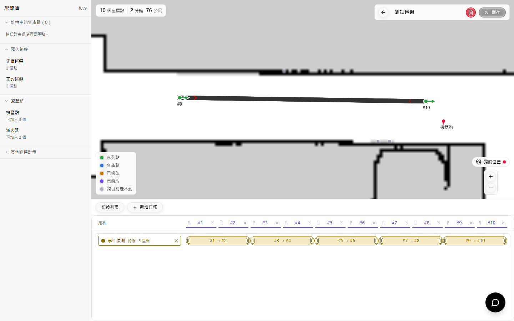

# Security Frontend 使用指南

[English](security-frontend-user-guide.md)

本指南依目前正式介面整理。頁籤與控制項會依角色、授權及設備能力而不同。

## 1. 概覽

Security Frontend 用於監看機器狗、派遣任務、查閱紀錄與錄影、管理地圖與巡邏、檢查健康，以及管理系統與使用者。

## 2. 登入與帳號

首次啟用依畫面完成授權、隱私同意與管理員建立。日後輸入帳號密碼登入；若管理員重設密碼，須先設定新密碼。帳號選單可查看角色、修改資料／密碼及登出。「設定 > 一般 > 系統」可切換語言、日期格式與主題。

## 3. 全域介面

側邊欄提供首頁、紀錄、重播、地圖、健康與設定。全域通知顯示伺服器離線、緊急事件及排程失敗；任務佇列顯示排隊、執行、暫停、完成與失敗步驟；右下角可開啟 NXDOG Assistant。沒有讀取權限的頁籤不顯示，沒有寫入權限時新增／儲存／刪除會隱藏或停用。

## 4. 快速開始：建立並執行巡邏

1. 在「設定 > 一般」確認目前地圖，並在首頁設定 Home 點及初始化位置。
2. 在「地圖 > 資產點」建立巡檢位置；需要固定行走順序時再建立路線。
3. 在「地圖 > 巡邏計畫」建立計畫，加入來源、排序節點並配置任務後儲存。
4. 在計畫卡設定排程，或由首頁「派遣 > 巡邏計畫」立即執行。
5. 從首頁時間軸監看，完成後到「紀錄 > 任務」確認軌跡、停靠點與結果。

## 5. 首頁儀表板

- 頂端選擇機器狗；電量、充電、活動、地圖、攝影機與任務會一起切換。清單可篩選正常或需注意設備。
- 攝影機可固定、暫停、重新整理、全螢幕；Lidar 可切資料來源、視圖、著色、殘影時間及重設視角。
- 地圖可縮放、拖曳；「跟隨」重新置中。障礙物按鈕循環障礙／完整雷射／關閉；不可達區域可顯示或隱藏。
- 「停止」清除目前任務；「暫停／繼續」保持或恢復佇列；工程模式可「略過」目前停靠點；「回家」建立返家任務。
- 「派遣」可選點擊前往、資產點、路線或巡邏計畫；確認預覽、順序及返家選項後送入佇列。
- 任務時間軸分過去／目前／即將執行；事件、近期執行與感測模組可開啟詳情或載入較早資料。

### 初始化位置

定位遺失、漂移或地圖位置錯誤時：

1. 按地圖工具列「初始化位置」（沒有目前地圖時仍可開啟）。
2. 選實際地圖；切換地圖會清除舊點位。
3. 在地圖點機器狗實際位置，以滑桿調整紅色箭頭朝向。
4. 按「送出」並等待成功訊息。
5. 回首頁確認標記位置與方向；不正確時重新設定。

### Home 點、禁區與工程模式

「設定 Home 點」後拖曳或點選位置、調整方向並儲存；返家前必須已有可達 Home 點。「禁行區」可新增形狀、名稱、有效時間，或編輯／刪除既有區域；清除全部前確認目前地圖。工程模式增加略過、手動駕駛及儀器控制，只供現場測試並應保持設備在視線內。

## 6. 紀錄

### 任務

左側卡片顯示計畫、完成／失敗／執行中、耗時、事件數與電量；右側顯示起訖時間、停靠點、軌跡、錄影、AI 委託及事件。選地圖標記或停靠點可定位詳情；展開可看任務結果、擷取、AI 觀察與原始回報。「完成」代表正常結束；無軌跡可能是非巡邏、未錄影或舊資料。

### 事件與緊急狀況

事件頁可依時間、類型、地圖及框選區域篩選，選取後查看圖片／位置、信心值與說明，並使用可用的報告下載。緊急狀況列出網路、導航、路徑與設備警報；以時間及任務 ID 對照相關任務。事件頁需 `events.read`。

## 7. 重播

選日期時間與攝影機，切換單／多格版面；使用播放、暫停、上一／下一事件及 `0.5×`–`8×`。拖曳、縮放或置中時間軸，地圖可跟隨軌跡。下載時選區間與攝影機；智慧搜尋需先選有影片的來源。空白時確認 NVR、錄影設定及時段。

## 8. 地圖管理

上方可選地圖與搜尋；新增／修改需對應 `.write` 權限。

### 資產點與路線

資產點：按 `+`，輸入名稱、選地圖、點位置、調方向，加入該點預設任務後儲存；卡片可編輯／刪除。路線：按 `+` 後依序點地圖建立點，調整位置、方向、速度與順序後儲存。

### 巡邏計畫與排程

卡片顯示點數、預估時間、地圖與排程。排程可設定名稱、日期區間、星期、開始／結束、間隔、完成返家及啟用狀態；儲存後在週排程確認。立即執行前確認返家選項；刪除排程不會刪計畫。

### 巡邏計畫編輯器

1. 輸入名稱；統計列顯示點數、時間與距離。
2. 從來源庫匯入路線、資產點或其他計畫，也可直接點地圖新增點。
3. 點節點查看座標、朝向與任務；拖曳改位置／順序，或刪除。下方序列亦可拖曳；`Shift` + 點選連續多選。
4. 「新增任務」選定點或路線形式。定點任務勾執行點；路線任務在甘特列橫拖區間，拖兩端改起訖，`×` 刪單一區間。
5. 切換列表／甘特圖編輯同一資料；不支援任務會標記並在執行時略過。
6. 儲存後等待成功。未儲存離開時選繼續、捨棄或先儲存；垃圾桶刪除整份計畫及內容。

## 9. 健康

服務狀態顯示 NVR、導航與控制服務；CPU、記憶體、Swap、磁碟、網路及馬達溫度圖表可查看趨勢與取樣值。持續高溫、磁碟滿載或服務離線時停止非必要任務並通知維護人員。

## 10. 設定

### 一般

- 個人化；主題、語言、日期；自動充電／重啟；巡邏與充電燈光。
- 重啟偵測、NVR、導航、全部服務或整機；會中斷服務，先確認安全。
- 選擇／上傳地圖；網路；時區、電腦同步與 NTP 伺服器。
- 上傳／預聽罐頭音檔；授權驗證；下載憑證及安裝指南。
- 軟體／模型自動或手動更新：核對版本與模組、開始後監看各階段，不可斷電。
- 選時間範圍下載系統診斷紀錄。

### 偵測、Agent 任務與通知

偵測頁啟停事件與調整門檻後儲存。Agent 任務可新增顯示名稱、基礎類型、動態參數與備註，供巡邏編輯器選用；刪除前確認沒有計畫使用。通知頁設定 Telegram 訂閱者、Email 收件者、寄件帳號與密碼；按 Enter 建立標籤後儲存。

### 工程

- 任務預設：新增／編輯／刪除重用參數。
- Coverage：選地圖、起點、區域與禁區，預覽後才送出。
- 攝影機：名稱、URL、帳密、啟用、錄影；測試後儲存或移除。
- 導航、更新節點：檢查可達性；管理節點／模組，空白或重複值不能存。
- ROS／磁碟健康、電池電壓、Lidar、系統紀錄：依時間、狀態與層級查看診斷資料。

### 使用者

具 `users.read` 與 `users.write` 才可新增、編輯角色、啟停、重設密碼與刪除。不能移除最後一位管理員或修改受保護帳號；重設後要求使用者首次登入改密碼。

## 11. 疑難排解

- 按鈕不可用：確認權限、必填資料、連線、地圖與任務狀態。
- 地圖位置錯誤：確認地圖後重新初始化位置；返家不可用則先設定可達 Home 點。
- 清單空白：清除篩選、放大日期範圍、確認設備時間。
- 影片／重播空白：確認攝影機、NVR、錄影與時段。
- 排程未執行：確認啟用、日期、星期、時間及未被略過。
- 儲存失敗：修正必填、重複或範圍錯誤；重新載入避免覆蓋他人修改。
- 更新停滯：不要重複啟動或斷電，查看更新階段、健康及系統紀錄。
